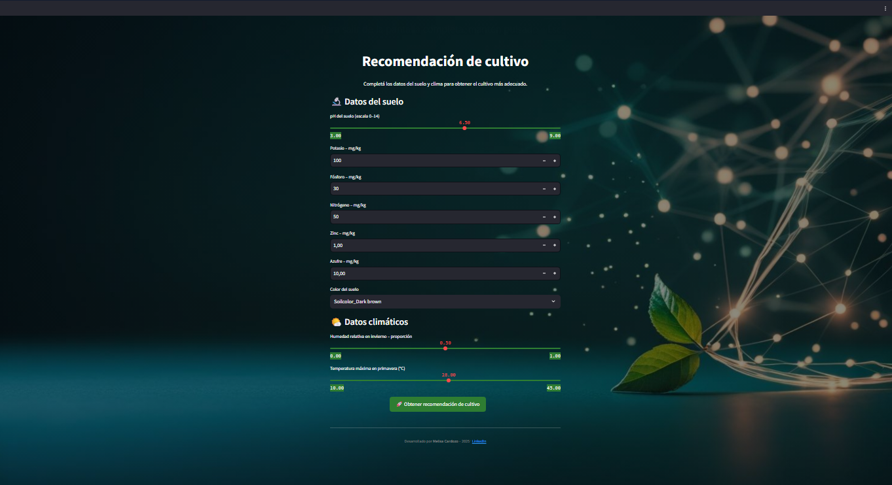

# 🌱 Recomendador de Cultivos Inteligente

Este proyecto es una aplicación interactiva desarrollada con **Streamlit** que recomienda cultivos ideales según variables agronómicas como pH del suelo, contenido de nitrógeno, fósforo y potasio, entre otros.

🔗 **Versión online publicada:**  
👉 [Abrir la app en Hugging Face](https://huggingface.co/spaces/Melisa-Cardozo/cultivo-inteligente)

---

## 📌 Objetivo

Ayudar a pequeños y medianos productores a tomar decisiones más informadas sobre qué cultivos sembrar según las condiciones del suelo, aplicando ciencia de datos y machine learning.

---

## 🧠 Tecnologías utilizadas

- Python
- PyCaret (clasificación automática)
- Streamlit (interfaz web)
- LightGBM (modelo final)
- pandas, matplotlib

---

## 📁 Estructura del proyecto

- `app.py`: interfaz principal de la aplicación en Streamlit
- `modelo_recomendacion_cultivos.pkl`: modelo entrenado con PyCaret
- `requirements.txt`: dependencias necesarias
- `Campo drone.jpg`: imagen usada en la app
- `README.md`: documentación del proyecto

---

## 📊 Fuente de datos

Este proyecto fue desarrollado utilizando el dataset [Crop Recommendation using Soil Properties and Weather Prediction](https://data.mendeley.com/datasets/8v757rr4st/1), publicado por Sltanu Alemu en Mendeley Data.

El conjunto de datos combina información de propiedades del suelo (como pH, nutrientes, conductividad eléctrica) y condiciones climáticas (temperatura, humedad, precipitación, entre otros), recopilados de diversas fuentes, incluyendo la infraestructura en la nube de la NASA y agencias agrícolas etíopes.

Los datos fueron utilizados con fines académicos y de demostración.

---

## 📷 Vista previa de la app

---

## ✍️ Autora

Melisa Cardozo  
Economista | Estudiante de Maestría en Ciencia de Datos | Apasionada por el agro y la sustentabilidad  
🔗 [LinkedIn](https://www.linkedin.com/in/melisacardozo)

---

📌 Este proyecto fue desarrollado con fines académicos y de portafolio.
